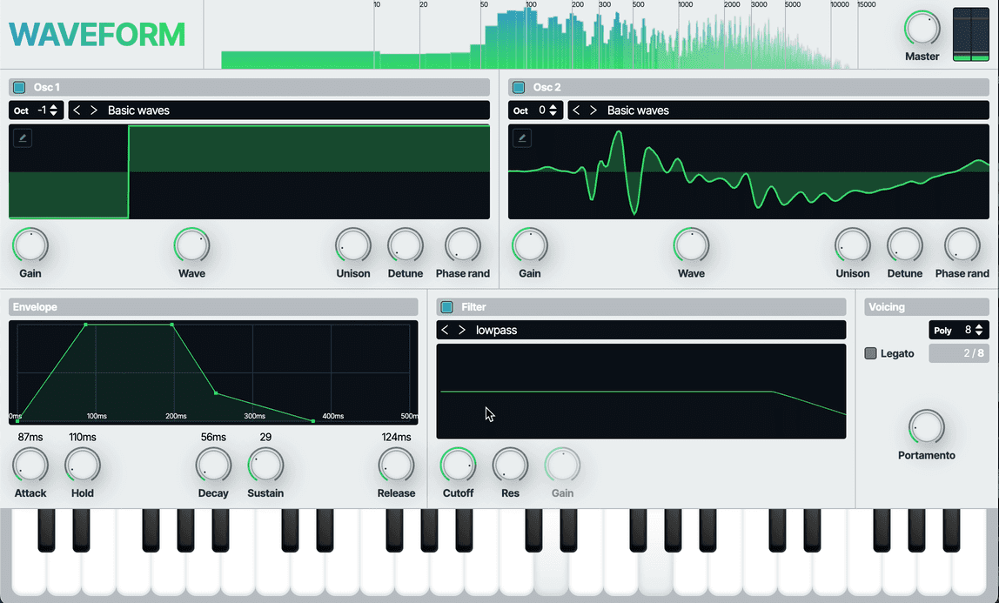

# Waveform - experimental synth in browser

[Demo](https://waveformaudio.netlify.app/)

Experimental wavetable synth written on TS and Web Audio.

## Features
* up to 12 voices with portamento and legato
* 2 panoramic osc with detune, unison up to 8 voices in each
* 7 basic audio filters
* input from onscreen, qwerty or midi keyboard
* envelope support
